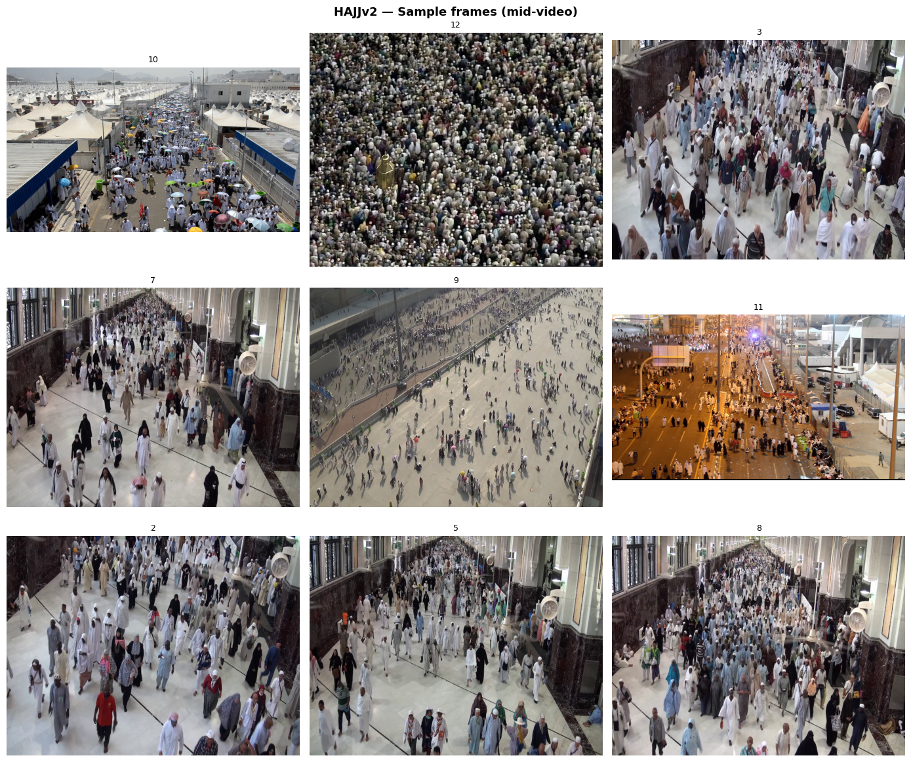
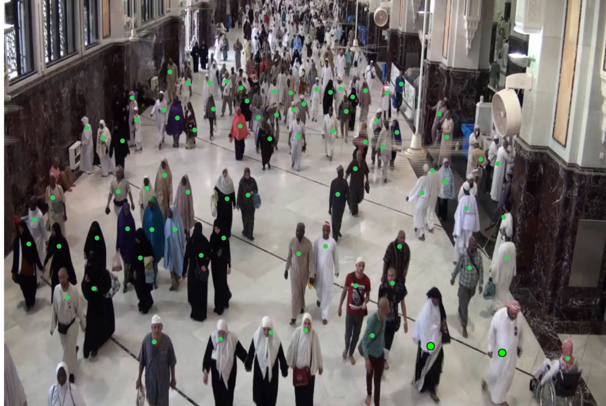

# HAJJv2-CrowdCount

## Original Dataset

This repository contains annotations only. The original HAJJv2 videos 
are not redistributed here and remain subject to their original terms.

**To download the original HAJJv2 videos:**

1. Visit the official dataset page:  
   https://github.com/KAU-Smart-Crowd/HAJJv2_dataset

2. Download the RAR file directly:  
   https://github.com/KAU-Smart-Crowd/HAJJv2_dataset/releases/download/v1.0.0/HAJJv2.Dataset.rar

3. Extract the RAR file using WinRAR or 7-Zip

## Overview

**HAJJv2-CrowdCount** is a frame level crowd count annotation benchmark built upon the HAJJv2 surveillance video dataset. The benchmark provides manually verified ground truth crowd counts for evaluating crowd counting algorithms under challenging real world Hajj scenarios.

The dataset was developed to support reproducible benchmarking of crowd counting methods on high density surveillance footage characterized by severe occlusion, perspective distortion, and varying camera viewpoints.

This release contains frame level crowd count annotations for both the training and testing partitions of HAJJv2 together with the documentation describing the annotation methodology and quality assurance procedures.



---

## Dataset Statistics

| Property               | Value |
| ---------------------- | ----: |
| Total Videos           |    18 |
| Training Videos        |     9 |
| Testing Videos         |     9 |
| Total Annotated Frames |   383 |
| Training Frames        |   216 |
| Testing Frames         |   167 |
| Sampling Rate          | 1 FPS |
| Minimum Crowd Count    |    56 |
| Maximum Crowd Count    |  1800 |
| Mean Crowd Count       | 319.6 |
| Median Crowd Count     |   112 |

---

## Dataset Characteristics

The dataset includes surveillance videos captured during Hajj under a variety of operational conditions.

Characteristics include:

* Low-, medium-, and high-density crowds
* Elevated surveillance viewpoints
* Top-down and oblique camera angles
* Perspective distortion
* Severe pedestrian occlusion
* Dynamic pedestrian flow
* Large variations in visible crowd size

These characteristics make the benchmark representative of real world crowd counting challenges.

---

## Annotation Methodology



Frames were extracted uniformly at **1 frame per second (1 FPS)**.

Ground truth annotations were generated through manual counting following a predefined annotation protocol designed to maximize consistency and reproducibility.

Each sampled frame was independently inspected by a human annotator.

To improve annotation reliability:

* Every frame was manually counted twice.
* Counting discrepancies were resolved through manual verification.
* Consistent counting rules were applied across all videos.

A detailed description of the annotation process is provided in:

```
annotations/annotation_protocol.md
```

Detailed counting rules are available in:

```
annotations/annotation_guidelines.pdf
```

---

## Annotation Format

Each annotation file follows the format:

| Column   | Description                       |
| -------- | --------------------------------- |
| video_id | Video identifier                  |
| time_s   | Timestamp in seconds              |
| gt_count | Verified ground truth crowd count |


## Repository Structure

```
HAJJv2-CrowdCount/
│
├── README.md
├── LICENSE
│
├── annotations/
│   ├── train_counts.csv
│   ├── test_counts.csv
│   ├── dataset_statistics.csv
│   ├── annotation_protocol.md
│   ├── annotation_guidelines.pdf
│  
│
└── examples/
    ├── example_frame_01.png
    ├── example_frame_02.png
    └── example_frame_03.png
```

---

## Files

### train_counts.csv

Frame level crowd count annotations for the training videos.

### test_counts.csv

Frame level crowd count annotations for the testing videos.

### dataset_statistics.csv

Summary statistics describing the released annotations.

### annotation_protocol.md

Description of the annotation methodology and verification process.

### annotation_guidelines.pdf

Detailed annotation rules followed during manual counting.

---

## Ground Truth Definition

The released ground truth represents the total number of valid people visible within each sampled frame according to the annotation guidelines.

Only verified final crowd counts are released.

---

## Intended Use

This benchmark is intended for:

* Crowd counting evaluation
* Zero shot crowd counting benchmarks
* Crowd analysis research
* Computer vision benchmarking
* Model comparison under dense crowd conditions

---

## Citation

TBC
---

## License

TBC

---

## Acknowledgements

TBC

---

## Contact

TBC
